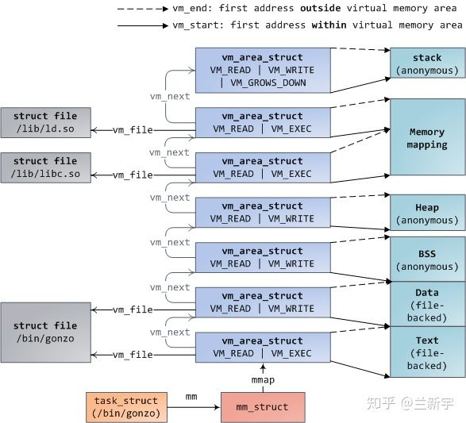

# 虚拟内存地址空间

```
平台    linux页表   地址分配	             可表示大小
x86     二级页表    10,10,12=32bit          4GB
x86_64	四级页表    9,9,9,9,12=48bit        256TB
```

## x86_64虚拟地址
整个虚拟地址空间的范围为2的48次方 ，按照1:1的比例划分，内核空间和用户空间各占128TB。用户虚拟空间占据底部，内核虚拟空间占据顶部。

<div style="text-align:center">
</div>
<br/>

但这段空闲区域也不是一点用都没有，它可以辅助进行地址有效性的检测。如果某个虚拟地址落在这段空闲区域，那就是既不在user space，也不在kernel space，肯定是非法访问了。使用48位虚拟地址，则kernel space的高16位都为1（0xFFFF），如果一个试图访问kernel space的虚拟地址的高16位不全为1，则可以判断这个访问也是非法的。同理，user space的高16位都为0。这种高位空闲地址被称为canonical。


https://blog.csdn.net/junmuzi/article/details/18056115

## 内核空间

在初始化内核空间页表时，大部分的内核空间已经映射好了。内核空间虚拟地址是所有进程共享的：内核进程共用一份内核页表，每个用户进程有独立的进程地址空间，其中的内核页表是一份init进程内核页表的拷贝（COW）。这样做的好处是避免了用户态通过系统调用或者中断陷入内核态的时候，不必切换地址空间。

Q：所有用户进程共享内核页表，为什么还需要每个进程独立一份？

A：如果所有进程在内核态都使用同一份页表，CPU从用户态进入内核态的所有场景（系统调用，硬中断），首先做的一个事情就是切页表，然后得刷TLB等事情，开销较大，不可接受，所以采用每个进程进入内核态进不需要切换页表的方案。

Q:每个进程独立一份内核页表，怎么保证数据同步？

A：Linux内核使用swapper_pg_dir作为主控页表，在内核页表发生变化之后，内核(暂时)只更新swapper_pg_dir，由于其它进程内核态页表是没有变化的，当在其它进程空间中内核态访问到这个页表的时候，会发生异常，那么kernel会把swapper_pg_dir的相应页表项拷贝到当前进程的的对应项，通过这种方式保持了内核页表在不同进程之间的所谓"同步"。

也就不再需要32位系统中的ZONE_HIGHMEM那种动态映射机制了。内核页表在内存申请的时候就会被设置好，这也是为什么说虚拟地址空间只适用于用户态的原因。

内核也不全是直接线性映射。用页表动态映射不全是为了内核空间可以访问更多的物理内存，还有一个重要原因： 当内核需要连续多页面的空间时，如果内核空间全线性映射，那么，可能会出现内核空间碎片化而满足不了这么多连续页面分配的需求。基于此，内核空间也必须有一部分是非线性映射，从而在这碎片化物理地址空间上，用页表构造连续虚拟地址空间,这就是所谓vmalloc空间。其工作原理和用户态 malloc 申请内存时的工作原理一致。kernel4.X开始，moudule的内存都在vmalloc区。

（vmalloc是分配虚拟空间连续，物理空间不连续的内核空间，主要是为了解决系统动态运行过程中，没有了连续物理内存空间，提高资源利用率）

TODO: 内核空间布局

## 用户空间


<div style="text-align:center">
</div>
<br/>

<div style="text-align:center">
</div>
<br/>

text段包含了当前运行进程的二进制代码，在IA64体系中通常为0x0000000000400000（都是虚拟地址哈）。

data段包含程序显式初始化的全局变量和静态变量，即已初始化且初值不为0的全局变量(也包括静态全局变量)和静态局部变量，这些数据是在程序真正运行前就已经确定的数据，所以可以提前加载到内存保存好。


bss段未初始化的全局变量和静态变量，这些变量的值是在程序真正运行起来并为其赋值后才能确定的，所以程序加载之初，只需要记录它的内存地址和所需大小。出于历史原因，这段空间也称为 BSS 段。

从上图可以看出，这3个segments是紧挨者的，因为它们的大小是确定的，不会动态变化。

与之相对应的就是heap段和stack段。

heap段存储动态分配的内存中的数据，堆用于存储那些生存期与函数调用无关的数据。如用系统调用 malloc 申请的内存便在堆上，这些申请的内存在不需要时必须手动释放，否则便会出现内存泄漏。

stack段用于保存局部变量和实现函数/过程调用的上下文，它们的大小都是会在进程运行过程中发生变化的，因此中间留有空隙，

heap向上增长，stack向下增长，因为不知道heap和stack哪个会用的多一些，这样设置可以最大限度的利用中间的空隙空间。进程每调用一次函数，都将为该函数分配一个栈帧，栈帧中保存了该函数的局部变量、参数值和返回值。

还有一个段比较特殊，是mmap()系统调用映射出来的。mmap映射的大小也是不确定的。3GB的虚拟地址空间已经很大了，但heap段, stack段，mmap段在动态增长的过程还是有重叠（碰撞）的可能。如果是64位系统，则虚拟地址空间更加巨大，几乎不可能发生重叠。


那这些segments的加载顺序是怎样的呢？以下图为例，fork()创建新进程后，首先通过execve()加载执行elf，则该可执行文件的text段，data段，stack段就建立了，

在进程运行过程中，可能需要借助ld.so加载动态链接库，比如最常用的libc，则libc.so的text段，data段也建立了，

而后可能通过mmap()的匿名映射来实现与其他进程的共享内存，还有可能通过brk()来扩大heap段的大小。

<div style="text-align:center">
</div>
<br/>

在Linux中，每个segment用一个vm_area_struct（以下简称vma）结构体表示。vma是通过一个双向链表（早期的内核实现是单向链表）串起来的，现存的vma按起始地址以递增次序被归入链表中，每个vma是这个链表里的一个节点。

<div style="text-align:center">
</div>
<br/>


<div style="text-align:center">
</div>
<br/>

<div style="text-align:center">
</div>
<br/>

同时，vma又通过红黑树（red black tree）组织起来，每个vma又是这个红黑树里的一个节点。为什么要同时使用两种数据结构呢？使用链表管理固然简单方便，但是通过查找链表找到与特定地址关联的vma，其时间复杂度是O(N)，而现实应用中，在进程地址空间中查找vma又是非常频繁的操作（比如发生page fault的时候）。

使用红黑树的话时间复杂度是O( logN )，尤其在vma数量很多的时候，可以显著减少查找所需的时间（数量翻倍，查找次数也仅多一次）。同时，红黑树是一种非平衡二叉树，可以简化重新平衡树的过程。

现在我们来看一下vm_area_struct结构体在Linux中是如何定义的（这里为了讲解的需要对结构体内元素的分布有所调整，事实上，结构体元素的分布是有讲究的，将相关的元素相邻放置并按cache line对齐，有利于它们在cache中处于同一条cache line上，提高效率）：


<details>
  <summary> <code>mm_struct</code> </summary>

``` C++ {.line-numbers}
struct mm_struct {
    struct vm_area_struct * mmap;    //指向虚拟区间(VMA)的链表
    struct rb_root mm_rb;            //指向线性区对象红黑树的根
    struct vm_area_struct * mmap_cache;     //指向最近找到的虚拟区间
    unsigned long(*get_unmapped_area) (struct file *filp,
    unsigned long addr, unsigned long len,
    unsigned long pgoff, unsigned long flags);//在进程地址空间中搜索有效线性地址区
    unsigned long(*get_unmapped_exec_area) (struct file *filp,
        unsigned long addr, unsigned long len,
        unsigned long pgoff, unsigned long flags);
    void(*unmap_area) (struct mm_struct *mm, unsigned long addr);//释放线性地址区间时调用的方法
    unsigned long mmap_base;                /* base of mmap area mmap区域的基地址*/
    unsigned long task_size;                /* size of task vm space 进程虚拟地址空间的大小*/

    unsigned long cached_hole_size;
    unsigned long free_area_cache;          //内核从这个地址开始搜索进程地址空间中线性地址的空闲区域
    pgd_t * pgd;                            //指向页全局目录
    atomic_t mm_users;                      //次使用计数器，使用这块空间的个数
    atomic_t mm_count;                      //主使用计数器
    int map_count;                          //线性的个数
    struct rw_semaphore mmap_sem;           //线性区的读/写信号量
    spinlock_t page_table_lock;             //线性区的自旋锁和页表的自旋锁

    struct list_head mmlist;              //指向内存描述符链表中的相邻元素

    /* Special counters, in some configurations protected by the
    * page_table_lock, in other configurations by being atomic.
    */
    mm_counter_t _file_rss; //mm_counter_t代表的类型实际是typedef atomic_long_t
    mm_counter_t _anon_rss;
    mm_counter_t _swap_usage;

    unsigned long hiwater_rss;    //进程所拥有的最大页框数
    unsigned long hiwater_vm;     //进程线性区中最大页数

    unsigned long total_vm, locked_vm, shared_vm, exec_vm;
    //total_vm 进程地址空间的大小(页数）
    //locked_vm 锁住而不能换出的页的个数
    //shared_vm 共享文件内存映射中的页数

    unsigned long stack_vm, reserved_vm, def_flags, nr_ptes;
    //stack_vm 用户堆栈中的页数
    //reserved_vm 在保留区中的页数或者在特殊线性区中的页数
    //def_flags 线性区默认的访问标志
    //nr_ptes 进程的页表数

    unsigned long start_code, end_code, start_data, end_data;
    //start_code 可执行代码的起始地址
    //end_code 可执行代码的最后地址
    //start_data已初始化数据的起始地址
    // end_data已初始化数据的最后地址

    unsigned long start_brk, brk, start_stack;
    //start_brk堆的起始位置
    //brk堆的当前的最后地址
    //start_stack栈的起始地址

    unsigned long arg_start, arg_end, env_start, env_end;
    //arg_start 命令行参数的起始地址
    //arg_end命令行参数的起始地址
    //env_start环境变量的起始地址
    //env_end环境变量的最后地址

    unsigned long saved_auxv[AT_VECTOR_SIZE]; /* for /proc/PID/auxv */

    struct linux_binfmt *binfmt;

    cpumask_t cpu_vm_mask; //用于惰性TLB交换的位掩码
    /* Architecture-specific MM context */
    mm_context_t context; //指向有关特定结构体系信息的表


    unsigned int faultstamp;
    unsigned int token_priority;
    unsigned int last_interval;

    unsigned long flags; /* Must use atomic bitops to access the bits */

    struct core_state *core_state; /* coredumping support */
#ifdef CONFIG_AIO
    spinlock_t              ioctx_lock;  //用于保护异步I/O上下文链表的锁
    struct hlist_head       ioctx_list;//异步I/O上下文
#endif
#ifdef CONFIG_MM_OWNER
    struct task_struct *owner;
#endif

#ifdef CONFIG_PROC_FS
    unsigned long num_exe_file_vmas;
#endif
#ifdef CONFIG_MMU_NOTIFIER
    struct mmu_notifier_mm *mmu_notifier_mm;
#endif
#ifdef CONFIG_TRANSPARENT_HUGEPAGE
    pgtable_t pmd_huge_pte; /* protected by page_table_lock */
#endif
#ifdef __GENKSYMS__
    unsigned long rh_reserved[2];
#else
    //有多少任务分享这个mm OOM_DISABLE
    union {
        unsigned long rh_reserved_aux;
        atomic_t oom_disable_count;
    };

    /* base of lib map area (ASCII armour) */
    unsigned long shlib_base;
#endif
};


```
</details>


<details>
  <summary> <code>vm_area_struct</code> </summary>

``` C++ {.line-numbers}
struct vm_area_struct 
{ 
	unsigned long vm_start; //开始地址
	unsigned long vm_end;  //结束地址
	struct vm_area_struct *vm_next, *vm_prev; 
	rb_node_t vm_rb; 
        unsigned long vm_flags;
        struct file * vm_file;
        unsigned long vm_pgoff;
	struct mm_struct * vm_mm; 
	...
}
```
</details>
其中，vm_start和vm_end分别是这个vma所指向区域的起始地址和结束地址，虽然vma是虚拟地址空间，但最终毕竟是要映射到物理内存上去的，所以也要求是4KB对齐的。

vm_next是指向链表的下一个vma，vm_rb是作为红黑树的一个节点。

vm_flags描述的是vma的属性，flag可以是VM_READ、VM_WRITE、VM_EXEC、VM_SHARED，分别指定vma的内容是否可以读、写、执行，或者由几个进程共享。前面介绍的页表PTE中也有类似的Read/Write权限限制位，那它和vma中的这些标志位是什么关系呢？

vma由许多的虚拟pages组成，每个虚拟page需要经过page table的转换才能找到对应的物理页面。PTE中的Read/Write位是由软件设置的，设置依据就是这个page所属的vma，因此一个vma设置的VM_READ/VM_WRITE属性会复制到这个vma所含pages的PTE中。

之后，硬件MMU就可以在地址翻译的过程中根据PTE的标志位来检测访问是否合法，这也是为什么PTE是一个软件实现的东西，但又必须按照处理器定义的格式去填充，这可以理解为软硬件之间的一种约定。那可以用软件去检测PTE么？当然可以，但肯定没有用专门的硬件单元来处理更快嘛。


## malloc


<div style="text-align:center">
</div>
<br/>

使用malloc首先是要经过内存分配器。为了内存分配函数malloc的高效性，ptmalloc会预先向操作系统申请一块内存供用户使用，并且ptmalloc会将已经使用的和空闲的内存管理起来；当用户需要销毁内存free的时候，ptmalloc又会将回收的内存管理起来，根据实际情况是否回收给操作系统。

TODO:详解ptmalloc
ref:https://blog.csdn.net/MOU_IT/article/details/115274083
https://blog.csdn.net/songchuwang1868/article/details/89951543
https://hanfeng.ink/post/understand_glibc_malloc/

如图所示，malloc经过系统调用brk()、mmap()，最终会调到底层的sys_brk函数和sys_mmap函数，在分配小内存时调用sys_brk函数，动态的调整进程地址空间中的brk位置；在分配大块内存时，调用sys_mmap函数，在堆和栈之间找到一片区域进行映射处理。
先来看sys_brk函数，通过SYSCALL_DEFINE1来定义，整体的函数调用流程如下：
<div style="text-align:center">
</div>
<br/>

<div style="text-align:center">
</div>
<br/>

ref:https://www.cnblogs.com/LoyenWang/p/12037658.html

整个过程看起来就比较清晰和简单了，每个进程都用struct mm_struct来描述自身的进程地址空间，这些空间都是一些vma区域，通过一个红黑树和链表来管理。因此针对malloc的处理，会去动态的调整brk的位置，具体的大小则由vm_area_struct结构中的vm_start ~ vm_end来指定。在实际过程中，会根据请求分配区域是否与现有vma重叠的情况来进行处理，或者重新申请一个vma来描述这段区域，并最终插入到红黑树和链表中。

另外，我们可以看到通常经过malloc之后，只是拓展了一下指针，没有建立页表项，更不会立即分配物理页面。只有当访问时，发生缺页异常，才会分配物理页面，并建立映射。而当malloc使用VM_LOCKED参数时，内核会人为的制造一次缺页异常，用户得到的结果就是malloc立马分配了物理页。

get_user_pages函数通过参数中的虚拟地址去请求对应的物理页。
mm_populate用来建立映射


TODO：page fault
ref：https://v1ckydxp.github.io/2020/04/22/2020-04-22-CVE-2016-5195%20%E6%BC%8F%E6%B4%9E%E5%88%86%E6%9E%90/


## mmap
mmap用于内存映射，也就是将一段区域映射到自己的进程地址空间中，分为两种：

    文件映射： 将文件区域映射到进程空间，文件存放在存储设备上；

    匿名映射：没有文件对应的区域映射，内容存放在物理内存上；

同时，针对其他进程是否可见，又分为两种：

    私有映射：将数据源拷贝副本，不影响其他进程；
    共享映射：共享的进程都能看到；

根据排列组合，就存在以下几种情况了：

    私有匿名映射： 通常分配大块内存时使用；

    共享匿名映射：常用于父子进程间通信，在内存文件系统中创建/dev/zero设备；

    私有文件映射：常用的比如动态库加载，动态库的代码段，数据段等；

    共享文件映射：常用于进程间通信，文件读写等；

mmap的操作，最终会调用到do_mmap函数，最后来一张调用图：

<div style="text-align:center">
</div>
<br/>
可以看到和sys_brk()十分相似。

## page fault
分析到malloc/mmap函数中，内核实现只是在进程的地址空间建立好了vma区域，并没有实际的虚拟地址到物理地址的映射操作，更没有分配物理页面。这部分就是在Page Fault异常错误处理中实现的。

Page Fault的异常处理，依赖于不同体系结构的实现。CPU产生中断后，主要是查询中断向量表，根据寄存器的信息，调用不同的函数。x86最终调用handle_page_fault()。5.13前为do_page_fault()。
（arch/x86/mm/fault.c）

handle_page_fault()中区分内核和用户，分别调用do_kern_addr_fault()和do_user_addr_fault()。

### do_user_addr_fault()：
```
首先，获取该进程的内存描述符mm_struct
通过mmmm_struct查找当前虚拟地址VMA。如果不存在，则是非法访问。
如果访问合法地址：
    根据页的错误类型与vma的访问权限是否匹配
    如果权限匹配：
        调用处理缺页的具体实现：handle_mm_fault-》__handle_mm_fault(); 
```
```
handle_mm_fault-》__handle_mm_fault()处理：
    进程在用户模式下访问用户虚拟地址，触发页错误异常；
    进程在内核模式下访问用户虚拟地址，触发页错误异常；
```
<div style="text-align:center">
</div>
<br/>

#### do_anonymous_page
```
匿名页的缺页异常处理调用本函数，在以下情况下会触发：
    malloc/mmap分配了进程地址空间区域，但是没有进行映射处理，在首次访问时触发；
    用户栈不够的情况下，进行栈区的扩大处理；
```

<div style="text-align:center">
</div>
<br/>

当需要分配的属性是只读的，系统会使用全部填充0的全局页empty_zero_page，称谓零页ZERO_PAGE，零页是在page_init()系统初始化过程中分配了一页的内存。并通过pte_mkspacial()设置了PTE flag——PTE_SPECIAL位。
如果有进程要去写这个带有PTE_SPACIAL的页会怎样呢？答案是发生page fault，调用do_wp_page，完成COW重新分配页来写。

当需要分配的属性是可写的，最终调用alloc_pages，x86中掩码GFP_HIGHUSER_MOVABLE | __GFP_ZERO，高端内存中分配填充为0的页，调用alloc_pages，也就是内核伙伴系统中分配物理内存的常用接口。

然后根据返回的page struct，填充pte即可。

#### do_wp_page

```
do_wp_page函数用于处理写时复制（copy on write），会在以下两种情况处理：
    创建子进程时，父子进程会以只读方式共享私有的匿名页和文件页，当试图写的时候，触发页错误异常，从而复制物理页，并创建映射；

    进程创建私有文件映射，读访问后触发异常，将文件页读入到page cache中，并以只读模式创建映射，之后发生写访问后，触发COW；
```
<div style="text-align:center">
</div>
<br/>
关键的复制工作是由wp_page_copy完成的：
<div style="text-align:center">
</div>
<br/>

### do_kern_addr_fault

<details>
  <summary> <code>do_kern_addr_fault</code> </summary>

``` C++ {.line-numbers}

static void
do_kern_addr_fault(struct pt_regs *regs, unsigned long hw_error_code,
           unsigned long address)
{
    //X86_PF_PK只针对用户态的page起作用
    WARN_ON_ONCE(hw_error_code & X86_PF_PK);
    //检测是否由于特有的bug产生
    if (is_f00f_bug(regs, hw_error_code, address))
        return;
  /*
    确保故障不是由以下引起的：
    1.不是在一个有保留位设置的PTE上的故障
    2.不是由user mode访问kernel mem访问引起的故障
    3.不是由违反页级保护引起的故障（反问一个不存在的页，且它的X86_PF_PROT==0）
    */
  //32位下检测是否是由于vmalloc_fault导致
    if (!(hw_error_code & (X86_PF_RSVD | X86_PF_USER | X86_PF_PROT))) {
        if (vmalloc_fault(address) >= 0)
            return;
    /*    是否是由于TLB陈旧导致的，没有及时更新 */
    if (spurious_kernel_fault(hw_error_code, address))
        return;
    /* 是否是kprobe hook了缺页错误 */
    if (kprobe_page_fault(regs, X86_TRAP_PF))
        return;
    //非法地址访问导致的错误
    bad_area_nosemaphore(regs, hw_error_code, address);
}
```
</details>
内核使用 vmalloc 来分配在虚拟内存中连续但在物理内存中不一定连续的内存，vmalloc区使用动态分配，非线形映射。

处理vmalloc或模块映射区的故障。之所以需要这样做，是因为vmalloc后不会更新所有进程的内核页表，当这些区域被访问时，会引起页错误。

主要的修复过程就是把 init 进程的 页表项 （全局）复制到当前进程的 页表项 中，这样就可以实现所有进程的内核内存地址空间同步。

<details>
  <summary> <code>do_kern_addr_fault</code> </summary>

``` C++ {.line-numbers}
static noinline int vmalloc_fault(unsigned long address)
{
    unsigned long pgd_paddr;
    pmd_t *pmd_k;
    pte_t *pte_k;
 
    /* 确保我们在系统的vmalloc区域 */
    if (!(address >= VMALLOC_START && address < VMALLOC_END))
        return -1;
    //首先拿到进程内核的PGD的物理地址（进程内核页表）以及全局内核页表，然后复制更新进程内核页表，完成同步
    pgd_paddr = read_cr3_pa();
    pmd_k = vmalloc_sync_one(__va(pgd_paddr), address);
 
    if (!pmd_k)
        return -1;
    //是否是大页（PSE）
    if (pmd_large(*pmd_k))
        return 0;
 
    //在pmd中找到pte的对应指针
    pte_k = pte_offset_kernel(pmd_k, address);
    //检查PTE是否存在于内存中，如果不存在则缺页
    if (!pte_present(*pte_k))
        return -1;
 
    return 0;
}
```
</details>

ref:https://bbs.pediy.com/thread-269149.htm


------------------------以下不讲--------------------------
### 用户地址空间映射
用户空间的地址都是虚拟地址，都要经过 MMU 的翻译，变成物理地址。用户空间的虚拟地址的映射，就是按前面所述的走四级页表来翻译。 页表在内核空间中。页表在内核空间中，用户无法修改。而页表的访问是硬件MMU完成的，不需要软件的参与。

#### cr3寄存器

用来存放页目录表物理内存基地址。

操作系统是怎么处理进程切换时的虚拟地址→物理地址的映射问题呢？很简单，切换页表。操作系统在切换进程时，也会从进程描述符种找到对应的页表地址，然后把该地址的页表加载进来（不同架构的方式不同，比如x86-64是将页表地址写入cr3寄存器）。如果通过系统调用、异常或中断进入内核态则会切换到内核页表。

cr3寄存器的加载是在进程调度的时候更新的，具体如下schedule()->context_switch()->switch_mm()->load_cr3(next->pgd)。load_cr3加载的是mm_struct->pgd，即线性地址，而实际上加裁到cr3寄存器的是实际的物理地址write_cr3(__pa(pgdir));在装载cr3寄存器时将线性地址通过__pa转换成了物理地址了，所以cr3寄存器是装的是实实在在的物理地址。

#### 四级页表（9，9，9，9，12）

第一级称为PGD，第二级称为PUD，第三级称为PMD，第四级称为PTE（也就是最终的页表项）。

页表大小位4KB,所以页内地址需要12位。虚拟地址64位，需要8B,那一页最多存储4KB/8B=2^9,即一级页表占用9位。

在IA64架构上，虽然是64位架构，但是真正可寻址的地址空间是48位，2的48次方：256TB。由于最后的12位是页内偏移量，所以页框号是48 - 12 = 36位。巧的是，IA64在硬件上也恰好用的是4级页表，每一级管理9位。第一级页表共有512个指针，指向512个第二级页表。每一个第二级页表包含512个指针，指向512个第三级页表。每一个第三级页表包含512个指针，指向512个第四级页表。每一个第四级页表包含512个页表项。

既然硬件上和软件上都采用的4级页表，那么最好办了！当给定一个虚拟地址时，把第(48, 39]这9位当作一个整数索引，查询第一级页表（PGD），得到一个第二级页表（PUD）的指针。 接着把第(39, 30]这9位当作一个整数索引，查询该第二级页表（PUD），得到一个第三级页表（PMD）的指针。然后把第(30, 21]这9位当作一个整数索引，查询该第三级页表（PMD），得到一个第四级页表（PTE）的指针。最后把第(21, 12]这9位当作一个整数索引，查询该第四级页表（PTE），得到页表项，即物理页框号。整个过程如下图所示：


<div style="text-align:center">
</div>
<br/>


有些硬件架构只有三级页表，上述代码还能工作吗？当然可以，那么Linux可以舍弃PUD或者PMD中任意一个。
另外，查页表全部在MMU中完成，四级页表也完全加载到MMU，避免内存的访问，提高效率。


查看页大小：getconf PAGE_SIZE
查看虚拟地址和物理地址位数：cat /proc/cpuinfo

https://blog.csdn.net/scylhy/article/details/92834714


```
TODO：
内核页表是不是拷贝

内核态改不能改内核页表

如果内核页表被内核修改，用户空间的页表是不是也全改了

ptmalloc
tcmalloc
jemalloc是不是预先请求页

free释放过程 
```